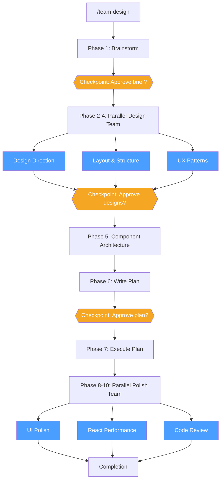

# Agent Teams Plugin

> Orchestrate multi-agent teams for parallel code review, hypothesis-driven debugging, and coordinated feature development using Claude Code Agent Teams. Presets let you spin up specialized teams in one command -- custom composition handles everything else.
>
> **Upstream:** [`wshobson/agents`](https://github.com/wshobson/agents) - `plugins/agent-teams/`

## Prerequisites

Agent Teams requires the experimental feature flag:

```bash
export CLAUDE_CODE_EXPERIMENTAL_AGENT_TEAMS=1
```

Every command in this plugin checks for this flag at startup and stops with an error if it is not set.

## Agents

### `team-lead`

Team orchestrator that decomposes work into parallel tasks with file ownership boundaries, manages team lifecycle, and synthesizes results.

| | |
|---|---|
| **Model** | `opus` |
| **Tools** | Read, Glob, Grep, Bash |
| **Use for** | Coordinating multi-agent teams, decomposing complex tasks, managing parallel workstreams |

**Invocation:**
```
Use the team-lead agent to coordinate [task]
```

**Key behaviors:**
- Selects optimal team size (2-5 teammates) based on task complexity
- Enforces one-owner-per-file rule to prevent conflicts
- Defines interface contracts at ownership boundaries
- Builds dependency graphs using blockedBy/blocks relationships
- Monitors progress at milestones, not every step

**Ecosystem integration:** The lead always selects specialized marketplace agents over generic team agents when the task matches. Full mapping covers code review (security-auditor, code-auditor, distributed-flow-auditor, ui-race-auditor, platform-reviewer), implementation (python-engineer, rust-engineer, frontend-engineer, tauri-desktop, web-designer), testing (test-writer, python-test-engineer), research (deep-researcher, quick-searcher, codebase-explorer), and documentation (documentation-engineer).

---

### `team-reviewer`

Multi-dimensional code reviewer that operates on one assigned review dimension with structured finding format.

| | |
|---|---|
| **Model** | `opus` |
| **Tools** | Read, Glob, Grep, Bash |
| **Use for** | Parallel code reviews across security, performance, architecture, testing, or accessibility dimensions |

**Invocation:**
```
Use the team-reviewer agent to review [target] for [dimension] issues
```

**Review dimensions:** Security, Performance, Architecture, Testing, Accessibility. Each finding includes location (`file:line`), severity (Critical/High/Medium/Low), evidence, impact, and recommended fix.

**Fallback role:** This agent is a fallback for dimensions without a specialized agent. When `senior-review:security-auditor`, `senior-review:code-auditor`, or `react-development:react-performance-optimizer` are available, the team-lead spawns those instead.

---

### `team-debugger`

Hypothesis-driven debugging investigator that gathers evidence to confirm or falsify an assigned hypothesis.

| | |
|---|---|
| **Model** | `opus` |
| **Tools** | Read, Glob, Grep, Bash |
| **Use for** | Debugging complex issues with multiple potential root causes, parallel hypothesis investigation |

**Invocation:**
```
Use the team-debugger agent to investigate [hypothesis]
```

**Investigation protocol:** Understand hypothesis, define evidence criteria (confirm/falsify/ambiguous), gather primary and supporting evidence, test the hypothesis, assess confidence (High >80%, Medium 50-80%, Low <50%), report structured findings with causal chain. Always cites `file:line` for every claim.

**Ecosystem integration:** Delegates to `research:deep-researcher` for complex evidence gathering, `codebase-mapper:codebase-explorer` for unfamiliar modules, and domain-specific agents (distributed-flow-auditor, ui-race-auditor, react-performance-optimizer, tauri-desktop) when the hypothesis touches their domain.

---

### `team-implementer`

Parallel feature builder that implements components within strict file ownership boundaries.

| | |
|---|---|
| **Model** | `opus` |
| **Tools** | Read, Write, Edit, Glob, Grep, Bash |
| **Use for** | Building features in parallel across multiple agents with file ownership coordination |

**Invocation:**
```
Use the team-implementer agent to build [component]
```

**File ownership protocol:**
- Only modifies files explicitly assigned in the task description
- Never touches shared files -- messages the team lead instead
- Creates new files only within assigned directories
- Interface contracts are immutable without team lead approval

**Fallback role:** This agent is a fallback for implementation tasks without a specialized agent. The team-lead spawns `python-development:python-engineer`, `frontend:frontend-engineer`, `tauri-development:rust-engineer`, or `testing:test-writer` when the task matches those contexts.

---

## Commands

### `/team-spawn`

Spawn an agent team using preset configurations or custom composition.

| | |
|---|---|
| **Invoke** | `/team-spawn <preset\|custom> [--name team-name] [--members N] [--delegate]` |
| **Presets** | review, debug, feature, fullstack, research, deep-search, security, migration, docs, app-analysis, tauri, ui-studio, custom |

```
/team-spawn review                  # 3-member review team (security + architecture + performance)
/team-spawn debug --name auth-bug   # 3-member debug team with custom name
/team-spawn feature --members 4     # 4-member feature team
/team-spawn fullstack --delegate    # 4-member full-stack team, enter delegation mode after spawn
/team-spawn custom                  # interactive: choose roles and team size
```

**Preset compositions:**

| Preset | Default Size | Agents |
|--------|-------------|--------|
| `review` | 3 | security-auditor + code-auditor + team-reviewer (or react-performance-optimizer) |
| `debug` | 3 | 3x team-debugger, each with a different hypothesis |
| `feature` | 3 | team-lead + 2 specialized implementers (auto-detected) |
| `fullstack` | 4 | team-lead + frontend-engineer + backend (python-engineer or team-implementer) + test-writer |
| `research` | 3 | deep-researcher + quick-searcher + codebase-explorer |
| `deep-search` | 4 | lead researcher + codebase analyst + web researcher + domain expert (auto-selected) |
| `security` | 4 | security-auditor + platform-reviewer + distributed-flow-auditor + security-auditor (separate scope) |
| `migration` | 4 | team-lead + 2 specialized implementers + code-auditor (verifier) |
| `docs` | 3 | codebase-explorer + documentation-engineer + code-auditor (accuracy verifier) |
| `app-analysis` | 3 | app-analyzer + deep-researcher + web-designer |
| `tauri` | 4 | team-lead + rust-engineer + frontend-engineer + tauri-desktop/tauri-mobile |
| `ui-studio` | 3+3 | Design wave (web-designer x2 + ui-layout-designer), then polish wave (web-designer + react-performance-optimizer + code-auditor) |

---

### `/team-review`

Launch a multi-reviewer parallel code review with specialized review dimensions.

| | |
|---|---|
| **Invoke** | `/team-review <target> [--reviewers security,performance,architecture,testing,accessibility] [--base-branch main]` |
| **Pipeline** | Resolve target -> Spawn dimension reviewers -> Monitor -> Deduplicate -> Consolidated severity report |

```
/team-review src/auth/                                    # default dimensions: security, performance, architecture
/team-review main...HEAD --reviewers security,testing     # review branch diff for security + testing
/team-review #42 --reviewers security,accessibility       # review PR #42
```

**Target types:** file/directory path, git diff range (e.g. `main...HEAD`), or PR number (e.g. `#42`). Spawns the most specialized agent per dimension -- `senior-review:security-auditor` for security, `senior-review:code-auditor` for architecture, `react-development:react-performance-optimizer` for React performance.

---

### `/team-debug`

Debug issues using competing hypotheses with parallel investigation by multiple agents.

| | |
|---|---|
| **Invoke** | `/team-debug <error-description-or-file> [--hypotheses N] [--scope files\|module\|project]` |
| **Pipeline** | Initial triage -> Generate N hypotheses -> Spawn investigators -> Evidence collection -> Arbitration -> Root cause report |

```
/team-debug "Users get 500 error when submitting the checkout form"
/team-debug src/api/handler.ts --hypotheses 4 --scope module
/team-debug "Memory usage grows unbounded after 1000 requests" --scope project
```

**Methodology:** Analysis of Competing Hypotheses (ACH). Generates hypotheses across 6 failure mode categories (Logic Error, Data Issue, State Problem, Integration Failure, Resource Issue, Environment). Each investigator reports confidence level, confirming/contradicting evidence with `file:line` citations, and causal chain. The arbitration phase ranks confirmed hypotheses and recommends a fix.

---

### `/team-feature`

Develop features in parallel with multiple agents using file ownership boundaries and dependency management.

| | |
|---|---|
| **Invoke** | `/team-feature <feature-description> [--team-size N] [--branch feature/name] [--plan-first]` |
| **Pipeline** | Analyze -> Decompose -> Spawn implementers -> Create tasks with dependencies -> Monitor -> Integration verification -> Cleanup |

```
/team-feature "Add OAuth2 login with Google and GitHub providers" --plan-first
/team-feature "Refactor payment module to support subscriptions" --team-size 3 --branch feature/subscriptions
```

**Key features:**
- `--plan-first` presents the decomposition (streams, file ownership, interface contracts, dependencies) for user approval before spawning agents
- Auto-detects codebase language to select specialized implementers (python-engineer, frontend-engineer, rust-engineer, test-writer)
- Integration verification runs build and tests after all streams complete

---

### `/team-delegate`

Task delegation dashboard for managing team workload, assignments, and rebalancing.

| | |
|---|---|
| **Invoke** | `/team-delegate [team-name] [--assign task-id=member-name] [--message member-name 'content'] [--rebalance]` |

```
/team-delegate feature-team                                  # show delegation dashboard
/team-delegate feature-team --assign 5=implementer-3         # assign task #5
/team-delegate feature-team --message implementer-1 'API contract updated, see types.ts'
/team-delegate feature-team --rebalance                      # analyze and rebalance workloads
```

**Dashboard shows:** unassigned tasks, member workloads (tasks in-progress + pending), blocked tasks with blocker status, and rebalancing suggestions (idle vs overloaded members).

---

### `/team-status`

Display team members, task status, and progress for an active agent team.

| | |
|---|---|
| **Invoke** | `/team-status [team-name] [--tasks] [--members] [--json]` |

```
/team-status                    # auto-discover active team
/team-status review-team        # specific team
/team-status --tasks            # tasks only
/team-status --json             # raw JSON output
```

---

### `/team-shutdown`

Gracefully shut down an agent team, collect final results, and clean up resources.

| | |
|---|---|
| **Invoke** | `/team-shutdown [team-name] [--force] [--keep-tasks]` |

```
/team-shutdown                          # auto-discover and shut down
/team-shutdown debug-team --force       # skip waiting for graceful responses
/team-shutdown feature-team --keep-tasks  # preserve task list after cleanup
```

Warns if tasks are still in-progress (unless `--force`). Sends `shutdown_request` to each teammate, waits for responses, then cleans up team resources.

---

### `/team-research`

Deep multi-source research with parallel investigators covering codebase, web, and domain-specific analysis.

| | |
|---|---|
| **Invoke** | `/team-research <question-or-topic> [--scope codebase\|web\|all] [--domain security\|architecture\|frontend\|python\|tauri\|business] [--depth quick\|standard\|deep]` |
| **Pipeline** | Analyze question -> Spawn researchers -> Parallel investigation -> Cross-reference -> Synthesized report with confidence levels |

```
/team-research "How does the auth middleware chain work?" --scope codebase
/team-research "Best practices for WebSocket reconnection" --scope web --depth deep
/team-research "Should we migrate from REST to gRPC?" --depth deep --domain architecture
```

**Depth levels:**
| Depth | Researchers | Roles |
|-------|-------------|-------|
| `quick` | 2 | Codebase analyst + Web researcher |
| `standard` | 3 | Codebase analyst + Web researcher + Context builder |
| `deep` | 4 | Codebase analyst + Web researcher + Context builder + Domain expert (auto-selected) |

Domain expert is auto-selected based on `--domain` flag or auto-detected from the topic: security-auditor, code-auditor, frontend-engineer, python-engineer, tauri-desktop, business-planner, or distributed-flow-auditor.

---

### `/team-codebase-map`

Parallel codebase mapping pipeline. Explores the project, runs 6 writer agents in parallel to generate narrative docs (overview, tech stack, workflows, onboarding, ops, config), then reviews and produces an INDEX.md with Mermaid diagrams.

| | |
|---|---|
| **Invoke** | `/team-codebase-map [target-path]` |
| **Pipeline** | Phase 1: `codebase-explorer` + `semantic-interconnect-mapper` -> Phase 2: 6 writer agents in parallel -> Phase 3: `guide-reviewer` produces INDEX.md |
| **Output** | `.codebase-map/` directory with 10 numbered narrative documents + INDEX.md |

```
/team-codebase-map                  # map the entire current project
/team-codebase-map src/auth         # map a specific subdirectory
```

**Parallel writers:** `overview-writer`, `tech-writer`, `flow-writer`, `onboarding-writer`, `ops-writer`, `config-writer` -- all from the `codebase-mapper` plugin. Produces human-readable narrative docs (not API reference).

**Context sharing:** Phase 1b generates an interconnect map (contracts, invariants, domain rules) via `senior-review:semantic-interconnect-mapper`, which all writers reference so facts stay consistent across the 10 documents.

---

### `/team-design`

Parallel UI design and build pipeline -- brainstorm, then run design direction + layout + UX patterns in parallel, build, polish + perf + review in parallel.

| | |
|---|---|
| **Invoke** | `/team-design <product-goal-or-feature> [--skip-brainstorm] [--skip-review] [--framework react\|vue\|svelte\|html]` |
| **Pipeline** | Brainstorm -> Parallel design team (3 agents) -> Component architecture -> Plan -> Execute -> Parallel polish team (3-4 agents) |
| **Checkpoints** | After brief, after design phase, after plan |
| **Output** | `.ui-studio/` directory with 10 artifact files |

```
/team-design "SaaS dashboard with real-time analytics and team management"
/team-design "Landing page for a developer tool" --skip-brainstorm --framework html
/team-design "E-commerce product catalog with filters" --framework react
```



**Parallelism savings:** Design wave runs 3 agents simultaneously (~60% design time saved). Polish wave runs 3-4 agents simultaneously (~70% review time saved). Sequential phases (brainstorm, component architecture, plan, execute) remain sequential because they depend on prior output.

---

## Skills

### `multi-reviewer-patterns`

Coordinate parallel code reviews across multiple quality dimensions with finding deduplication, severity calibration, and consolidated reporting.

**Reference files:**
- `references/review-dimensions.md` -- dimension allocation, deduplication rules, severity calibration

---

### `parallel-debugging`

Debug complex issues using competing hypotheses with parallel investigation, evidence collection, and root cause arbitration.

**Reference files:**
- `references/hypothesis-testing.md` -- hypothesis generation framework, evidence standards, arbitration protocol

---

### `parallel-feature-development`

Coordinate parallel feature development with file ownership strategies, conflict avoidance rules, and integration patterns for multi-agent implementation. Covers vertical slices vs horizontal layers, interface contracts, and merge strategies.

**Reference files:**
- `references/file-ownership.md` -- ownership assignment, conflict prevention
- `references/merge-strategies.md` -- integration patterns for parallel work streams

---

### `task-coordination-strategies`

Decompose complex tasks, design dependency graphs, and coordinate multi-agent work with proper task descriptions and workload balancing.

**Reference files:**
- `references/task-decomposition.md` -- breaking work into parallelizable units
- `references/dependency-graphs.md` -- blockedBy/blocks relationships, critical path analysis

---

### `team-communication-protocols`

Structured messaging protocols for agent team communication including message type selection, plan approval, shutdown procedures, and anti-patterns to avoid.

**Reference files:**
- `references/messaging-patterns.md` -- direct message vs broadcast, shutdown requests, coordination at integration points

---

### `team-composition-patterns`

Design optimal agent team compositions with sizing heuristics, preset configurations, and agent type selection. Covers display mode configuration (tmux, iTerm2, in-process) and custom team building.

**Reference files:**
- `references/preset-teams.md` -- preset configurations and their compositions
- `references/agent-type-selection.md` -- choosing subagent_type for each role

---

## Ecosystem Integration

A defining feature of this plugin is its deep integration with the broader marketplace. Rather than using generic agents, the team-lead and commands always prefer specialized marketplace agents when they match the task context.

**Review tasks** delegate to `senior-review` agents (security-auditor, code-auditor, distributed-flow-auditor, ui-race-auditor) and `platform-engineering:platform-reviewer`.

**Implementation tasks** delegate to `python-development:python-engineer`, `frontend:frontend-engineer`, `tauri-development:rust-engineer`, `tauri-development:tauri-desktop`, `frontend:web-designer`, and `frontend:ui-layout-designer`.

**Testing tasks** delegate to `testing:test-writer` and `python-development:python-test-engineer`.

**Research tasks** delegate to `research:deep-researcher`, `research:quick-searcher`, and `codebase-mapper:codebase-explorer`.

**Documentation tasks** delegate to `codebase-mapper:documentation-engineer`.

**Planning phases** use `ai-tooling:brainstorming`, `ai-tooling:writing-plans`, and `ai-tooling:executing-plans`.

The generic team-reviewer, team-implementer, and team-debugger agents are used only when no specialized agent matches the task context.

---

## Diagram Legend

| Symbol | Meaning |
|--------|---------|
| Blue boxes | Parallel agents (run simultaneously) |
| Orange diamonds | Checkpoints (require your approval to proceed) |

---

**Related:** [senior-review](senior-review.md) (specialized review agents) | [ai-tooling](ai-tooling.md) (brainstorming, planning, execution skills) | [frontend](frontend.md) (web-designer, ui-layout-designer, frontend-engineer) | [research](research.md) (deep-researcher, quick-searcher)
