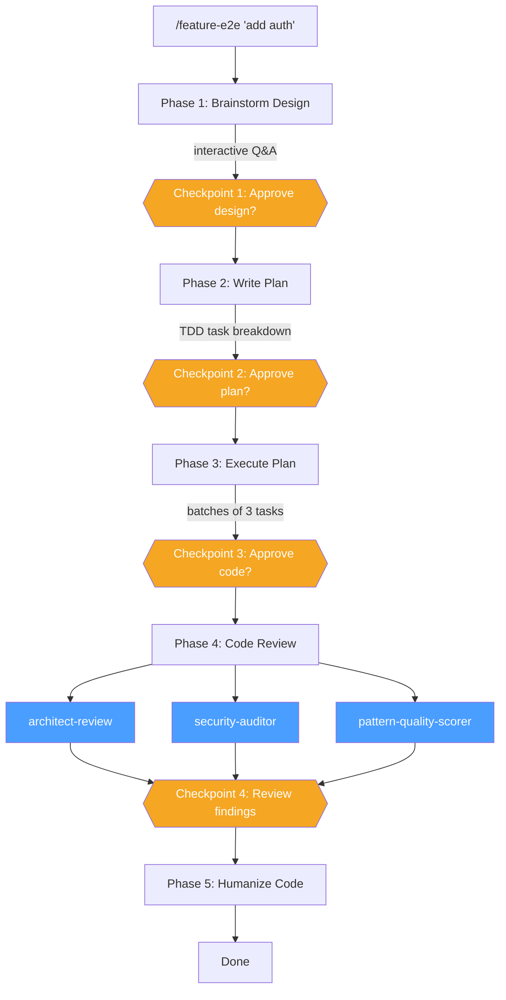
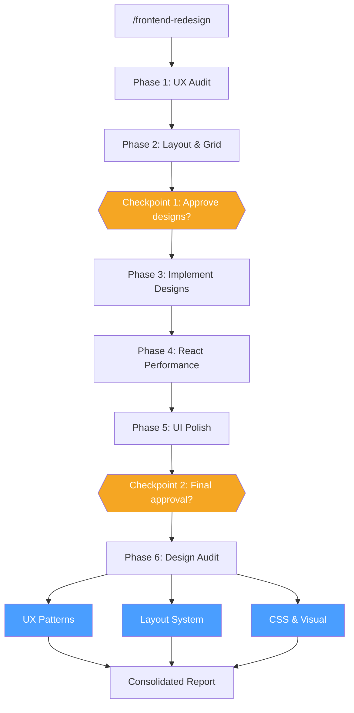
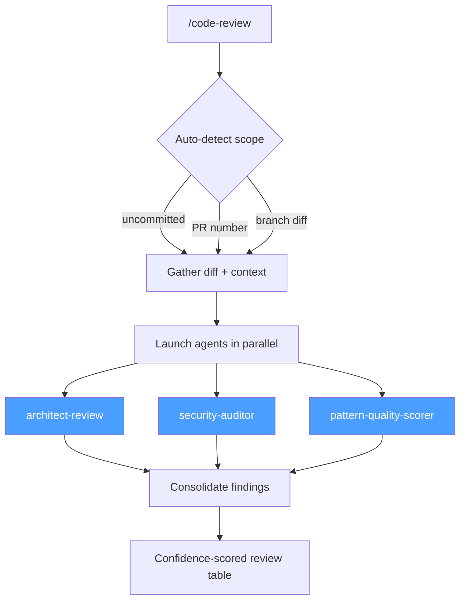
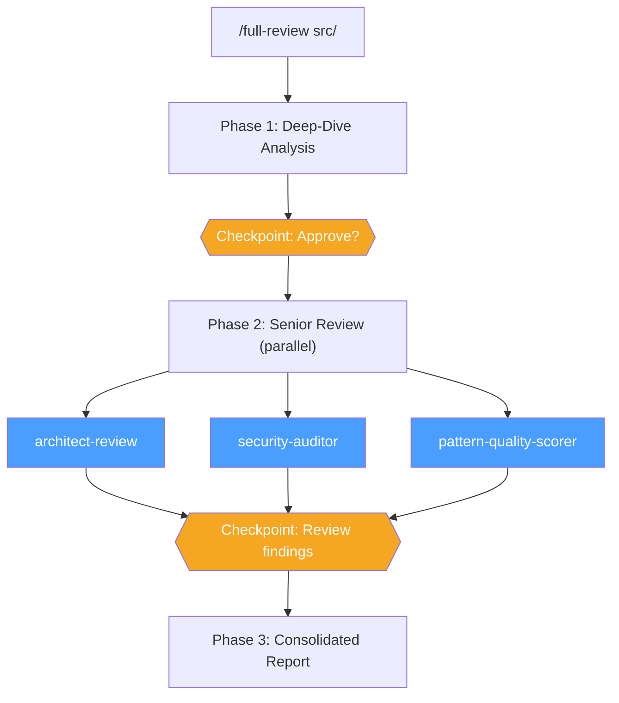
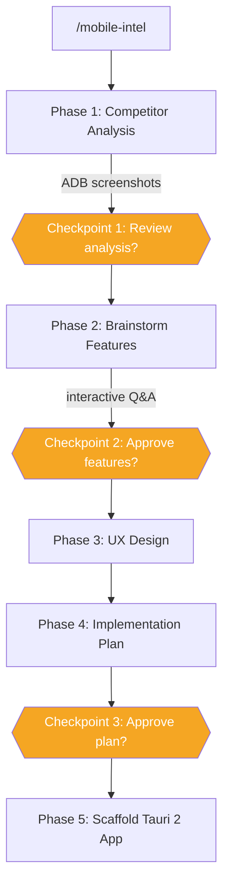
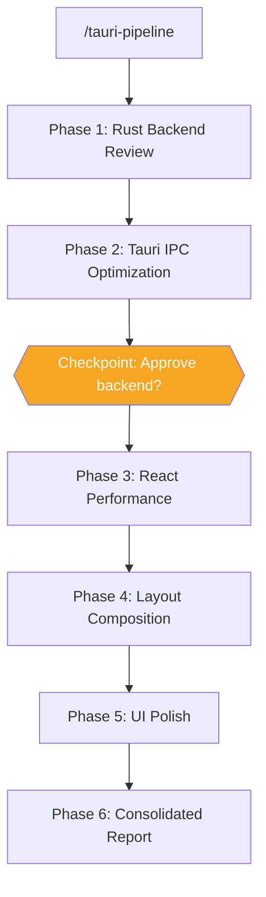

<!-- MERGED FROM: docs/workflows.md (Mermaid diagrams) + docs/plugins/workflows.md (command reference) -->
# Workflows Plugin

> Run entire development workflows with one command. Chains brainstorming, planning, implementation, code review, and cleanup into automated pipelines with checkpoints at each stage.
>
> **Dependencies:** [frontend](frontend.md), [react-development](react-development.md), [senior-review](senior-review.md), [clean-code](clean-code.md), [ai-tooling](ai-tooling.md), [tauri-development](tauri-development.md), [app-analyzer](app-analyzer.md), [deep-dive-analysis](deep-dive-analysis.md), [platform-engineering](platform-engineering.md), [testing](testing.md), [git-worktrees](git-worktrees.md)

## Commands

### `/feature-e2e`

End-to-end feature pipeline: brainstorm design, write implementation plan, execute with TDD checkpoints, review changes (architecture + security + patterns), and humanize code.

| | |
|---|---|
| **Invoke** | `/feature-e2e <feature description> [--skip-brainstorm] [--skip-humanize] [--strict-mode]` |
| **Pipeline** | brainstorming -> writing-plans -> executing-plans -> senior-review -> humanize |
| **Checkpoints** | After design, plan, execution, and review phases |
| **Dependencies** | [ai-tooling](ai-tooling.md), [senior-review](senior-review.md), [clean-code](clean-code.md) |

---

### `/frontend-redesign`

Full frontend redesign pipeline: UX audit, layout system design, implementation, React performance optimization, UI polish, and final design audit with visual report. Use this to **improve existing frontend code** -- not to plan or build from scratch.

| | |
|---|---|
| **Invoke** | `/frontend-redesign <target path> [--framework react\|vue\|svelte] [--skip-performance] [--strict-mode]` |
| **Pipeline** | web-designer -> ui-layout-designer -> frontend-design -> react-performance-optimizer -> web-designer -> design audit |
| **Checkpoints** | After layout spec and polish phases |
| **Output** | `.frontend-redesign/report.md` -- actionable checklist with before/after comparison |
| **Dependencies** | [frontend](frontend.md), [react-development](react-development.md) |

> **Not sure which to use?** `/frontend:premium-web-consultant` for strategy ("what to build"), `/frontend:ui-studio` for new builds ("build it from scratch"), `/frontend-redesign` for existing code ("improve what we have").

---

### `/code-review`

Auto-detects scope (uncommitted changes, commits, or PR) and fires review agents in parallel.

| | |
|---|---|
| **Invoke** | `/code-review [PR#] [--commits N] [--branch name] [--auto-comment]` |
| **Pipeline** | Detect scope -> Gather diff -> architect-review + security-auditor + pattern-quality-scorer in parallel -> Consolidated report |
| **Dependencies** | [senior-review](senior-review.md) |

---

### `/full-review`

Full codebase review pipeline: deep-dive structural analysis followed by senior multi-agent code review with consolidated scoring.

| | |
|---|---|
| **Invoke** | `/full-review <target path or description> [--skip-deep-dive] [--security-focus] [--performance-critical] [--strict-mode] [--framework react\|spring\|django\|rails]` |
| **Pipeline** | deep-dive-analysis -> architect-review -> security-auditor -> pattern-quality-scorer -> consolidated report |
| **Checkpoints** | After deep-dive and after architecture/security phases |
| **Dependencies** | [deep-dive-analysis](deep-dive-analysis.md), [senior-review](senior-review.md) |

---

### `/mobile-intel`

Competitive mobile intelligence: analyze a competitor Android app via ADB, brainstorm differentiating features, design improved UX, write an implementation plan, and scaffold a Tauri 2 mobile app.

| | |
|---|---|
| **Invoke** | `/mobile-intel <app-package-name> [--device <device-id>] [--skip-scaffold]` |
| **Pipeline** | analyze-mobile-app -> brainstorming -> web-designer -> writing-plans -> tauri-mobile |
| **Checkpoints** | After analysis, brainstorm, and plan phases |
| **Pre-flight** | Verifies ADB device connection |
| **Dependencies** | [app-analyzer](app-analyzer.md), [ai-tooling](ai-tooling.md), [frontend](frontend.md), [tauri-development](tauri-development.md) |

---

### `/tauri-pipeline`

End-to-end Tauri 2 desktop app pipeline: Rust backend review, Tauri IPC optimization, React performance, layout composition, and UI polish.

| | |
|---|---|
| **Invoke** | `/tauri-pipeline <target path> [--rust-only] [--frontend-only] [--strict-mode]` |
| **Pipeline** | rust-engineer -> tauri-desktop -> react-performance-optimizer -> ui-layout-designer -> web-designer |
| **Checkpoints** | After Tauri IPC review |
| **Pre-flight** | Verifies `src-tauri/` directory and `tauri.conf.json` exist |
| **Dependencies** | [tauri-development](tauri-development.md), [frontend](frontend.md), [react-development](react-development.md) |

---

### `/mobile-tauri-pipeline`

End-to-end mobile app pipeline: competitor analysis via ADB, feature brainstorm, UX design, implementation plan, Tauri 2 mobile scaffold, Rust backend review, and IPC optimization.

| | |
|---|---|
| **Invoke** | `/mobile-tauri-pipeline <app-package-name or description> [--device <device-id>] [--skip-scaffold] [--skip-review] [--strict-mode]` |
| **Pipeline** | analyze-mobile-app -> brainstorming -> web-designer -> writing-plans -> tauri-mobile -> rust-engineer -> tauri-desktop |
| **Checkpoints** | After analysis, brainstorm, plan, and scaffold phases |
| **Dependencies** | [app-analyzer](app-analyzer.md), [ai-tooling](ai-tooling.md), [frontend](frontend.md), [tauri-development](tauri-development.md) |

---

### `/ui-studio`

End-to-end UI development pipeline: brainstorm product concept, design direction, layout, UX patterns, write implementation plan, execute with TDD, polish, performance review, and code review.

| | |
|---|---|
| **Invoke** | `/ui-studio <product goal or feature description> [--skip-brainstorm] [--skip-review] [--skip-humanize] [--strict-mode] [--framework react\|vue\|svelte\|html]` |
| **Pipeline** | brainstorming -> web-designer -> ui-layout-designer -> writing-plans -> executing-plans -> web-designer -> react-performance-optimizer -> code-review -> humanize |
| **Checkpoints** | After design, plan, execution, polish, and review phases |
| **Dependencies** | [ai-tooling](ai-tooling.md), [frontend](frontend.md), [react-development](react-development.md), [senior-review](senior-review.md), [clean-code](clean-code.md) |

---

### `/python-pipeline`

End-to-end Python development pipeline: architecture design, TDD execution, and refactoring polish.

| | |
|---|---|
| **Invoke** | `/python-pipeline <task description> [--skip-tests] [--refactor-only]` |
| **Pipeline** | python-architect -> python-test-engineer -> python-refactor-agent |
| **Checkpoints** | After architecture design, TDD execution, and refactoring phases |
| **Dependencies** | [python-development](python-development.md) |

---

## Diagram Legend

| Symbol | Meaning |
|--------|---------|
| Blue boxes | Parallel agents (run simultaneously) |
| Orange diamonds | Checkpoints (require your approval to proceed) |

---

**Related:** [senior-review](senior-review.md) (review agents used in pipelines) | [ai-tooling](ai-tooling.md) (brainstorming and planning skills) | [frontend](frontend.md) (UI agents for redesign pipelines)
