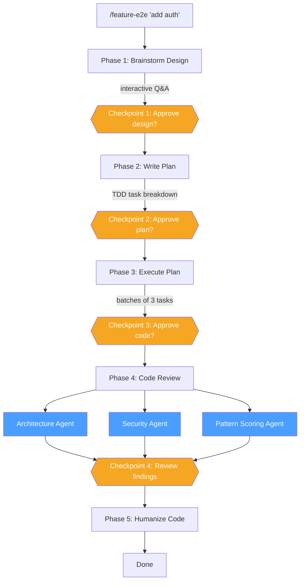
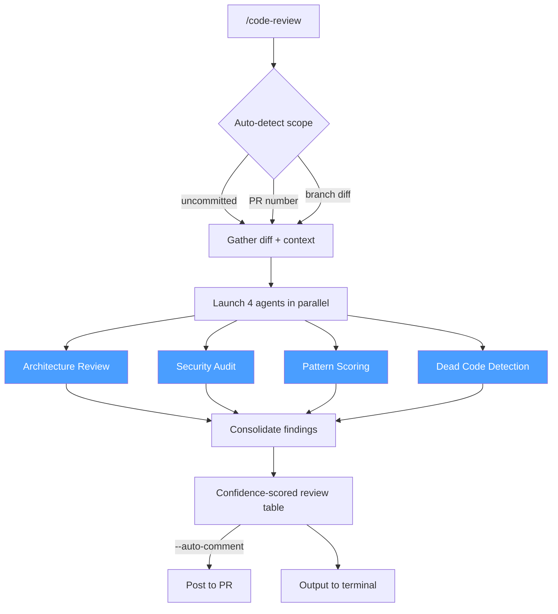
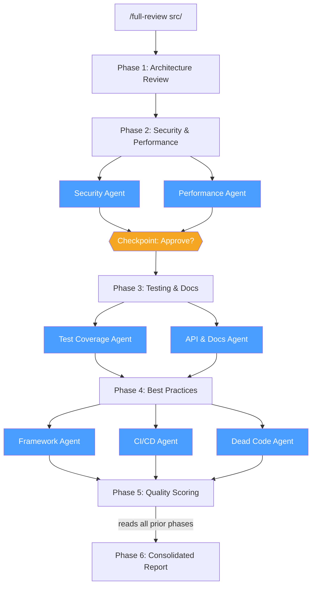
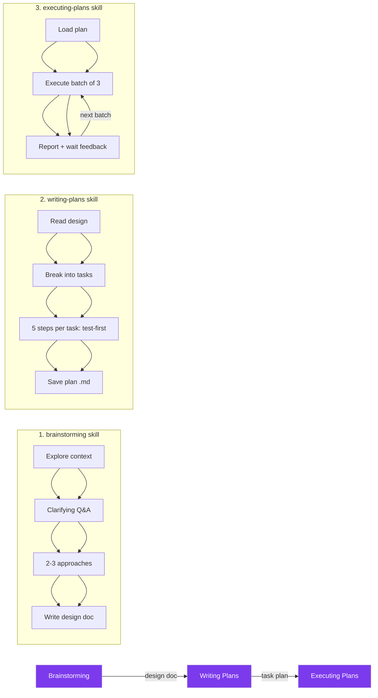
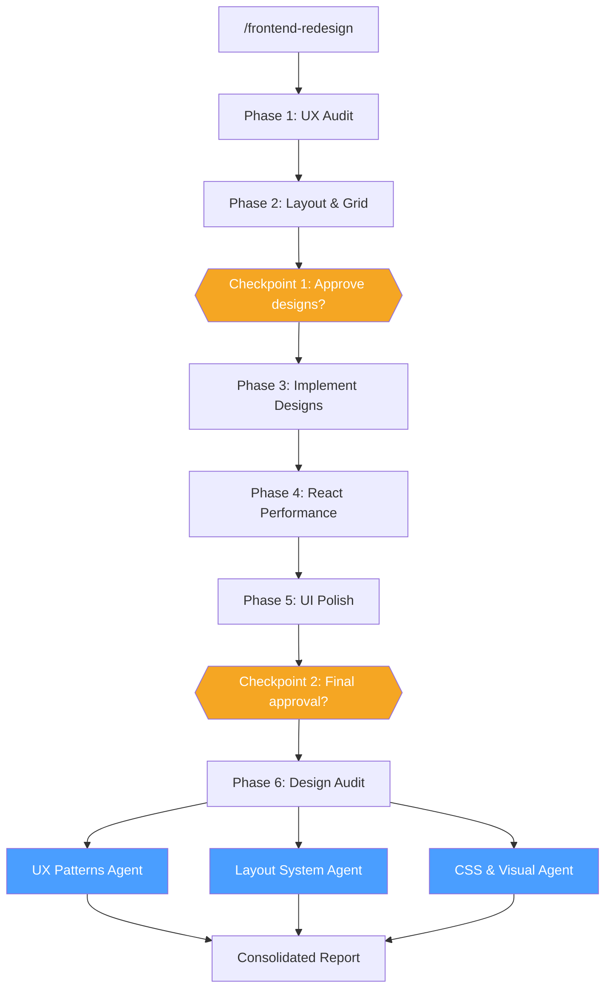
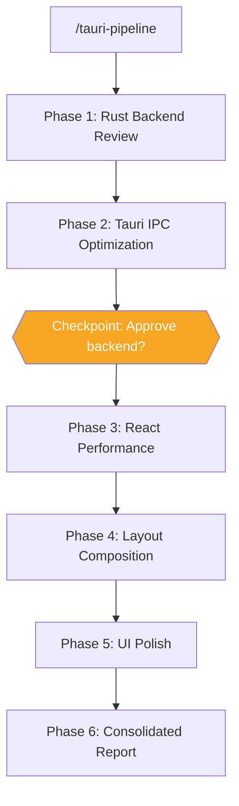
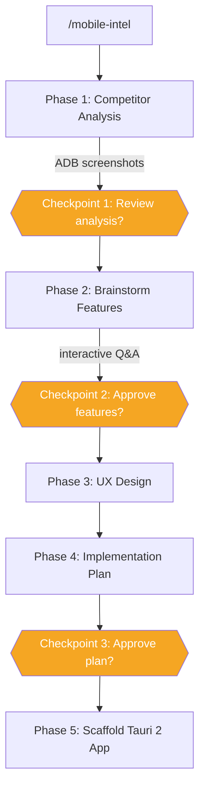

# Quick Start Workflows

## Feature End-to-End (`/feature-e2e`)

The most complete pipeline -- takes a feature idea from brainstorming through implementation to code review in a single command.

```
/feature-e2e "add user authentication"
```



---

## Code Review (`/code-review`)

Auto-detects scope (uncommitted changes, commits, or PR) and fires 4 agents in parallel.

```
/code-review              # auto-detect scope
/code-review 42           # review PR #42
/code-review --auto-comment  # post findings as PR comments
```



---

## Full Review (`/full-review`)

Deep 6-phase review with progressive parallelization -- each wave builds on prior findings. Available in both `senior-review` (standalone review) and `workflows` (deep-dive + review combined) plugins.

```
/full-review src/ --security-focus
```



---

## AI-Assisted Planning

Three skills that chain together -- each one feeds into the next with hard gates preventing premature implementation.



---

## Frontend Redesign (`/frontend-redesign`)

Full redesign pipeline from UX audit to polished implementation with parallel final audit.

```
/frontend-redesign src/ --framework react
```



---

## Tauri Pipeline (`/tauri-pipeline`)

Desktop app optimization across Rust backend, Tauri IPC, and React frontend layers.

```
/tauri-pipeline             # full pipeline
/tauri-pipeline --rust-only  # backend only
```



---

## Mobile Intelligence (`/mobile-intel`)

Competitive analysis pipeline -- analyze a competitor Android app and scaffold your own.

```
/mobile-intel com.competitor.app
```



---

## More Workflows

### Python Development
```
1. /python-scaffold FastAPI microservice
2. Implement features with python-pro agent
3. /python-refactor on complex modules
4. Use python-tdd for test coverage
```

### Legacy Code Modernization
```
1. /deep-dive-analysis to understand codebase
2. /python-refactor on legacy modules
3. Use python-tdd to add test coverage
4. /humanize to clean up naming and comments
```

### Tauri App Optimization
```
1. Use tauri-optimizer for IPC and Rust backend
2. Use react-performance-optimizer for React frontend
3. Use ui-layout-designer for page composition
4. Use ui-polisher for animations and polish
```

### CLAUDE.md Maintenance
```
1. /maintain-claude-md for quarterly maintenance
2. Review audit findings
3. Choose: audit-only or apply improvements
4. Or /create-claude-md to start fresh
```

### Optimization & Scheduling with CSP
```
1. Use or-tools-expert agent for constraint programming
2. Model problem with variables, domains, and constraints
3. Enable parallelism and performance optimizations
4. Test on small instances before scaling up
```

**Example problems:** Employee shift scheduling, job shop scheduling, bin packing, vehicle routing, assignment problems with cost minimization.

---

## Diagram Legend

| Symbol | Meaning |
|--------|---------|
| Blue boxes | Parallel agents (run simultaneously) |
| Orange diamonds | Checkpoints (require user approval to proceed) |
| Purple boxes | Skills (knowledge modules with structured workflows) |
